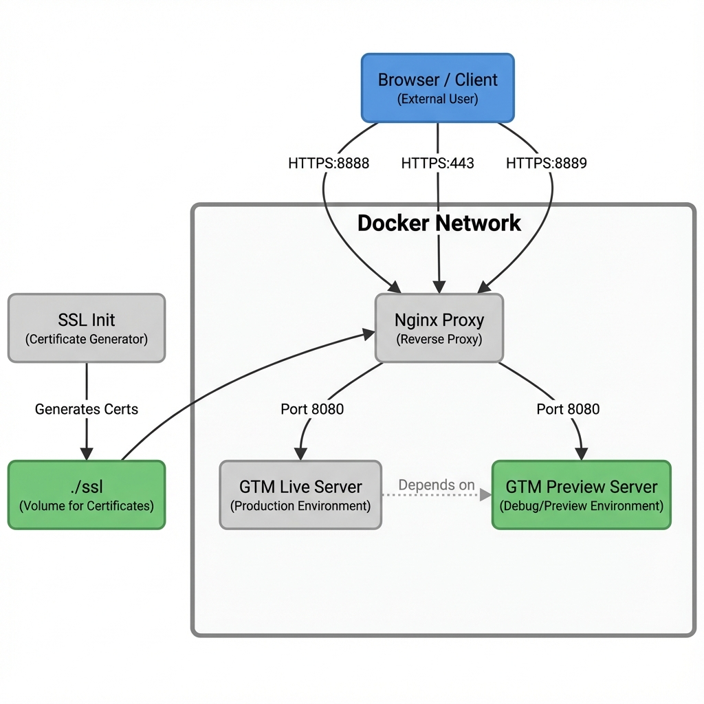

# Local Server-Side Google Tag Manager

Simulates a Google Tag Manager Server-Side environment locally using Docker. Perfect for debugging/developing your server-side implementation and templates without needing cloud infrastructure (GCP/AWS).

It also includes **Performance Testing** tools for benchmarking, and will include **Node.js Server Files Debugging**.

### Table of Contents

- [Prerequisites](#prerequisites)
- [Quick Start](#quick-start)
- [Architecture](#architecture)
- [Configuration](#configuration)
- [Custom Domains](#custom-domains)
- [Troubleshooting](#troubleshooting)
- [Performance Testing](#performance-testing)
- [Node.js Server Files Debugging](#nodejs-server-files-debugging)
- [License](#license)

---

## Prerequisites

Before you begin, ensure you have the following:

- **sGTM Container**: You need access to a Google Tag Manager Server-Side container.
- **Docker**: Install a container runtime. You have two main options:
  - **Docker Desktop**: [Download and Install](https://docs.docker.com/desktop/setup/install/mac-install/#install-interactively)
  - **Colima** (Lightweight alternative):
    - **Homebrew**: [Install Homebrew](https://brew.sh/#install) if you haven't already.
    - **Install Colima**:
    ```bash
    brew install colima docker docker-compose
    ```

---

## Quick Start

### 1. Configure Environment Variables

```bash
# Copy the example environment file
cp .env.example .env

# Edit with your actual values
nano .env
```

Set the following in `.env`:

```bash
# Get this from GTM Admin > Container Settings
CONTAINER_CONFIG=your_container_config_here

# (Optional) Set a custom domain
CUSTOM_DOMAIN=sgtm.example.com

# (Optional) Set a custom port in the local machine
PORT_TAGGING_SERVER=8888
PORT_PREVIEW_SERVER=8889

# (Optional) Set memory and cpu limits
MEMORY_LIMIT_SERVER=512m
CPU_LIMIT_SERVER=1

```

### 2. Start the Stack

SSL certificates are **automatically generated**. Just run:

```bash
docker-compose up -d
```

This starts:
- GTM Preview Server (for debugging)
- GTM Live Server (for production simulation)
- nginx HTTPS Proxy (ports 443, 8888, 8889)

### 3. Test It

```bash
# Check all containers are healthy
docker-compose ps

# Verify GTM containers
curl -k https://localhost:8888/healthy  # Live server
curl -k https://CUSTOM_DOMAIN/healthy # Live server - if CUSTOM_DOMAIN is configured
curl -k https://localhost:8889/healthy  # Preview server
```

### 4. Add localhost to your server side container

Add `https://localhost:8888` or `https://CUSTOM_DOMAIN` to your server side container sites. Now you can preview and debug a server side container without server setup.

**That's it!** Click the test buttons and watch events flow through your server-side GTM container.

---

## Architecture

The system consists of 4 Docker services:

```
┌───────────────────────────────────────────────────┐
│  Browser                                          │
│  ├─> https://localhost:8888 (GTM Live)            │
│  ├─> https://CUSTOM_DOMAIN (GTM Live - optional)  │
│  └─> https://localhost:8889 (GTM Preview)         │
└───────────────────────────────────────────────────┘
              ↓
┌───────────────────────────────────────────────────┐
│  ssl-init (one-time)                              │
│  └─> Generates SSL certificates                   │
└───────────────────────────────────────────────────┘
              ↓
┌───────────────────────────────────────────────────┐
│  nginx (HTTPS Proxy)                              │
│  ├─> Port 8888, 443 (CUSTOM_DOMAIN) → gtm-live    │
│  └─> Port 8889 → gtm-preview                      │
└───────────────────────────────────────────────────┘
              ↓
┌────────────────────────────┐    ┌───────────────────────────────┐
│  gtm-live (internal:8080)  │    │  gtm-preview (internal:8080)  │
│  (Production)              │    │  (Debug Mode)                 │
└────────────────────────────┘    └───────────────────────────────┘
```



### Service Details

| Service | Container | Ports | Purpose |
|---------|-----------|-------|---------|
| ssl-init | ssl-init | - | Generates SSL certificates (runs once) |
| gtm-preview | gtm-preview | Internal:8080 | GTM Preview Server |
| gtm-live | gtm-live | Internal:8080 | GTM Live Server |
| nginx | gtm-nginx | 443, 8888, 8889 | HTTPS Proxy for GTM |

---

## Configuration

### Environment Variables

#### Required

- **`CONTAINER_CONFIG`** - Base64-encoded GTM container configuration
  - Get from: GTM Admin > Container Settings > Container Config
  - Format: Base64 string

#### Optional

- **`CONTAINER_REFRESH_SECONDS`** - Interval between container refreshes to fetch the latest version of the container.
  - Default: `25`

- **`CUSTOM_DOMAIN`** - Optional custom domain (e.g., `sgtm.example.com`)
  - Default: `localhost`

- **`PORT_TAGGING_SERVER`** - HTTPS Port for the Live Server in local machine
  - Default: `8888`

- **`PORT_PREVIEW_SERVER`** - HTTPS Port for the Preview Server in local machine
  - Default: `8889`

- **`MEMORY_LIMIT_SERVER`** - Memory limit for the containers (e.g., `512m`, `1g`)
  - Default: unlimited (as much as host system allows)

- **`CPU_LIMIT_SERVER`** - CPU limit for the containers (e.g., `0.5` for 50% of a core, `1.5` for 1.5 cores)
  - Default: unlimited (as much as host system allows)

### Example .env File

```bash
# GTM Configuration
CONTAINER_CONFIG=aWQ9AAANLVdSOUo0NTROJmVudj0xJmF1dGg9bnRMejlYRHhVU1RBd1VaOHdSb3N2dw==
CONTAINER_REFRESH_SECONDS=25
CUSTOM_DOMAIN=sgtm.example.com
MEMORY_LIMIT_SERVER=512m
CPU_LIMIT_SERVER=1
```

---

## Custom Domains

You can use a custom domain (e.g., `https://sgtm.example.com`) instead of `localhost`.

### 1. Configure the Domain

Edit your `.env` file and set the `CUSTOM_DOMAIN` variable:

```bash
CUSTOM_DOMAIN=sgtm.example.com
```

### 2. Update Hosts File

Map the domain to your local machine in `/etc/hosts`:

```bash
sudo nano /etc/hosts
```

Add this line:
```
127.0.0.1 {CUSTOM_DOMAIN}
# e.g. 127.0.0.1 sgtm.example.com
```

### 3. Regenerate Certificates

If you already have containers running, you need to regenerate the SSL certificates:

```bash
# Remove old certificates
rm -rf ssl/

# Restart and rebuild to generate new ones
docker-compose down
docker-compose up -d
```

### 4. Access the Servers

- **Live Server**: `https://sgtm.example.com` (Port 443) OR `https://sgtm.example.com:8888`
- **Preview Server**: `https://sgtm.example.com:8889`

---

## Troubleshooting

### Containers Not Starting

```bash
# Check container status
docker-compose ps

# View logs for specific service
docker-compose logs gtm-live
docker-compose logs gtm-preview
docker-compose logs nginx
docker-compose logs ssl-init

# Check all logs
docker-compose logs -f
```

### SSL Certificate Issues

SSL certificates are automatically generated. If there are issues:

```bash
# Manually regenerate certificates
./generate-ssl.sh

# Check if certificates exist
ls -la ssl/

# Remove and regenerate
rm -rf ssl/
docker-compose up -d
```

### GTM Container Configuration Issues

```bash
# Verify CONTAINER_CONFIG is set
docker exec gtm-live env | grep CONTAINER_CONFIG
docker exec gtm-preview env | grep CONTAINER_CONFIG

# If empty, check your .env file
cat .env

# Restart containers after .env changes
docker-compose restart
```

### Port Already in Use

```bash
# Find what's using the default ports
lsof -i :8888 # (or your PORT_TAGGING_SERVER value)
lsof -i :8889 # (or your PORT_PREVIEW_SERVER value)
lsof -i :443

# To change ports, update your .env file:
PORT_TAGGING_SERVER=9000
PORT_PREVIEW_SERVER=9001

# After changing ports, restart the stack:
docker-compose down
docker-compose up -d
```

### HTTPS Browser Warnings

Self-signed certificates will show browser warnings. This is normal for local development.

**Chrome**: Click "Advanced" → "Proceed to localhost (unsafe)"
**Firefox**: Click "Advanced" → "Accept the Risk and Continue"
**Safari**: Click "Show Details" → "visit this website"

### Reset Everything

```bash
# Stop and remove all containers
docker-compose down

# Remove everything including images
docker-compose down --rmi all --volumes

# Remove SSL certificates
rm -rf ssl/

# Start fresh
docker-compose up -d --build
```

---

## Performance Testing

This project includes a suite of tools for benchmarking and stress-testing your sGTM container. You can find scripts for generating load (using `wrk` and `curl`) and monitoring resource usage in the `performance-testing` directory.

[**View Performance Testing Documentation**](./performance-testing/README.md)

---

## NodeJS Server Files Debugging

This project will include a suite of tools for debugging the Node.js files used by the sGTM container, namely: `server_bin.js`, `server_bootstrap.js` and `server.js`.

[**View Node.js Server Files Debugging Documentation**](./nodejs-server-files-debugging/README.md)

---

## License

[MIT License](./LICENSE.txt) - feel free to use this in your projects!

---

Forked from [justushamalainen/datalayer-relay](https://github.com/justushamalainen/datalayer-relay).
